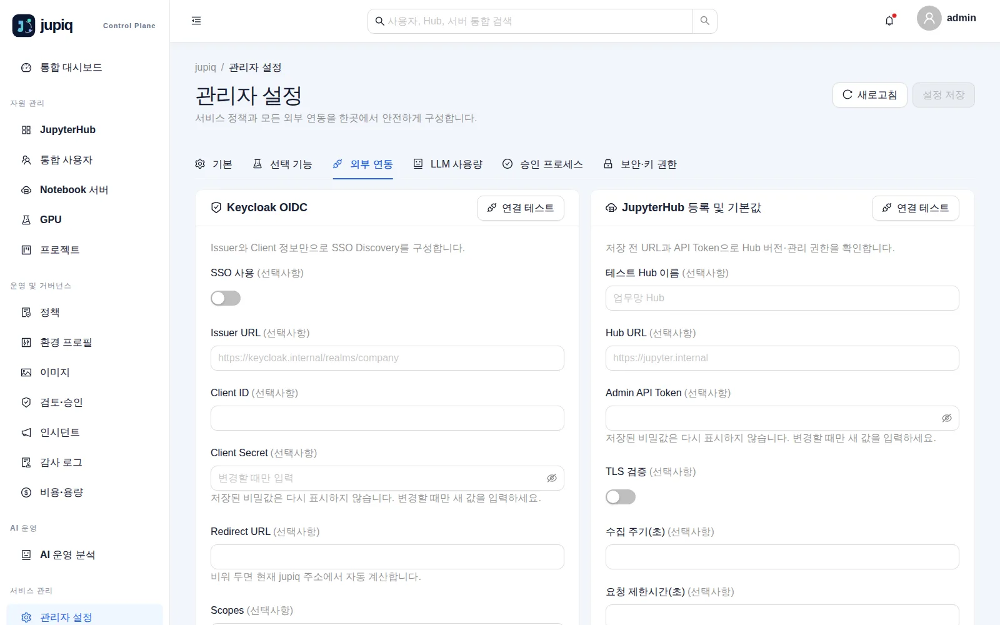
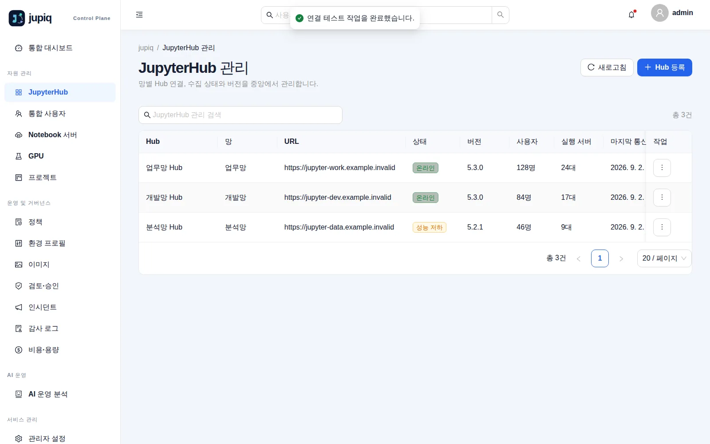
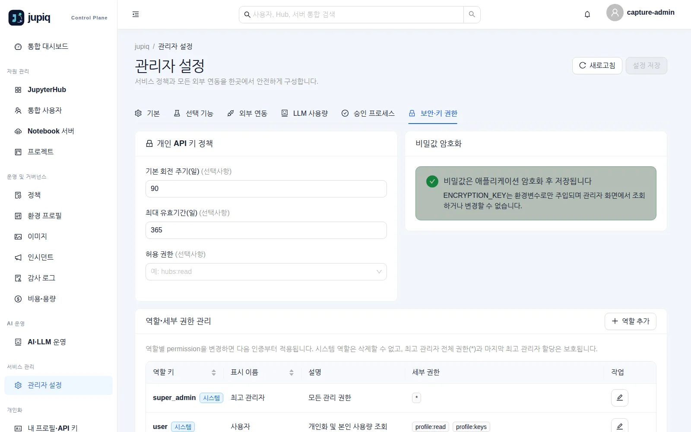

# jupiq 관리자 가이드

이 문서는 jupiq **v1.4.13**을 오프라인망에 설치하고 운영하는 사람을 위한 것입니다.
화면을 쓰는 방법은 [사용자 가이드](USER_GUIDE.md)에 있으니 여기서 되풀이하지 않습니다.
실린 화면은 모두 실제 jupiq를 띄워 찍은 것이며, 주소·이름·키는 데모용 가짜 값입니다.

---

## 1. 구성 요소

jupiq는 **컨테이너 하나**입니다. Go 서버가 REST API와 SPA를 같은 포트로 서비스하고, 같은 프로세스 안에서
수집기(collector)가 30초 주기로 돕니다. 상태는 전부 PostgreSQL에 있습니다.

| 구성 요소 | 필수 | 역할 |
|---|---|---|
| `jupiq` 컨테이너 | 필수 | REST API + SPA + 수집기. 기본 포트 `8080` |
| PostgreSQL | 필수 | 유일한 영속 저장소. 스키마 마이그레이션은 jupiq가 기동할 때 적용 |
| JupyterHub | 필수(1개 이상) | 관리 대상. Hub REST API(`/hub/api`)를 관리자 토큰으로 호출 |
| Keycloak(OIDC) | 선택 | SSO 로그인. 끄면 로컬 Bootstrap 관리자만 로그인 |
| Prometheus | 선택 | CPU·메모리 자원 메트릭, GPU·LLM 사용량 수집원 |
| Kubernetes API | 선택 | Pod ↔ 사용자 매핑, Node/Pod 메타데이터 |
| NVIDIA DCGM Exporter | 선택 | GPU·VRAM 지표(Prometheus를 통해 조회) |
| OpenAI 호환 AI Provider | 선택 | `AI 운영 분석` 스트리밍 응답 |
| Webhook 수신 서버 | 선택 | 관리자 설정의 연결 테스트 대상 |

주고받는 것은 이렇습니다.

- **밖으로 나가는 호출**: JupyterHub REST, Prometheus HTTP API, Kubernetes API, AI Provider, Webhook.
  모두 관리자가 설정한 대상에만 나갑니다.
- **안으로 들어오는 호출**: 브라우저(HttpOnly `jupiq_session` 쿠키), 자동화(`Authorization: Bearer <JWT|jqk_…>`),
  MCP 클라이언트(`POST /mcp`).
- **수집하지 않는 것**: Notebook 소스·셀·사용자 파일, AI 프롬프트와 응답 본문.

선택 수집기가 실패해도 로그인·Hub 관리 같은 핵심 기능은 계속 동작합니다.

---

## 2. 설치

릴리스 자산은 **jupiq 서비스 이미지 tar.gz 하나**입니다. PostgreSQL 이미지는 포함하지 않으므로 따로 반입하세요.

### 2.1 반입물 확인

```bash
# GitHub Release 본문의 64자리 SHA-256을 승인 기록과 대조
JUPIQ_ARCHIVE_SHA256='릴리스-본문의-SHA256'
printf '%s  %s\n' "${JUPIQ_ARCHIVE_SHA256}" jupiq-v1.4.13.tar.gz | sha256sum -c -
gzip -t jupiq-v1.4.13.tar.gz
gzip -dc jupiq-v1.4.13.tar.gz | docker load
docker image inspect jupiq:v1.4.13 --format '{{index .Config.Labels "org.opencontainers.image.version"}}'
```

### 2.2 PostgreSQL 준비

jupiq는 스키마를 스스로 만듭니다. 빈 데이터베이스와 그 소유자 계정만 준비하면 됩니다.

```bash
psql -h <db-host> -U postgres -c "CREATE ROLE jupiq LOGIN PASSWORD '<강한-비밀번호>';"
psql -h <db-host> -U postgres -c "CREATE DATABASE jupiq OWNER jupiq;"
```

운영에서는 `sslmode=verify-full`과 검증 가능한 서버 인증서를 쓰세요.

### 2.3 환경 파일 만들기

읽는 환경변수는 **정확히 네 개**입니다. 소스 체크아웃이 있으면 `.env.example`을 복사하고, tar.gz만 반입했으면
아래 네 줄을 직접 씁니다.

```bash
umask 077
cat > .env <<'EOF'
POSTGRES_DSN=postgres://jupiq:<비밀번호>@<db-host>:5432/jupiq?sslmode=verify-full
BOOTSTRAP_ADMIN=admin
BOOTSTRAP_ADMIN_PASSWORD=<12자 이상 임시 비밀번호>
ENCRYPTION_KEY=<openssl rand -base64 32 결과>
EOF
```

`ENCRYPTION_KEY`는 이렇게 만듭니다.

```bash
openssl rand -base64 32
```

### 2.4 실행

단일 컨테이너로 띄우는 방법:

```bash
docker run -d --name jupiq --restart unless-stopped --init \
  --env-file .env -p 127.0.0.1:8080:8080 \
  --read-only --tmpfs /tmp:size=64m,mode=1777 \
  --cap-drop ALL --security-opt no-new-privileges:true \
  jupiq:v1.4.13
curl --fail http://127.0.0.1:8080/readyz
```

Compose를 쓰려면 같은 태그 소스의 `compose.example.yaml`과 `.env`를 함께 반입하고:

```bash
docker compose --env-file .env -f compose.example.yaml up -d
docker compose --env-file .env -f compose.example.yaml ps
```

`compose.example.yaml`은 `read_only`, `cap_drop: ALL`, `no-new-privileges`, `/tmp` tmpfs 64MiB와
`wget`으로 `/healthz`를 때리는 healthcheck(15초 간격, 5회 재시도, 시작 유예 20초)를 이미 담고 있습니다.

### 2.5 포트 · 볼륨 · 자원

| 항목 | 값 | 비고 |
|---|---|---|
| 수신 포트 | `8080/tcp` | 컨테이너가 여는 유일한 포트. 기본 예시는 `127.0.0.1`에만 게시 |
| 나가는 포트 | PostgreSQL(보통 5432), 각 연동 대상의 HTTPS | 방화벽에서 대상별로 허용 |
| 볼륨 | 없음 | 루트 파일시스템은 읽기 전용, `/tmp`만 tmpfs. 영속 데이터는 전부 PostgreSQL |
| 컨테이너 자원 | Hub 수와 수집 주기에 비례 | Hub 프로브는 동시 8개로 제한됨 |

### 2.6 최초 관리자 계정

기동할 때 `BOOTSTRAP_ADMIN` 계정이 없으면 만들고, 시스템 역할 `super_admin`(전체 권한 `*`)과
`user`(`profile:read`, `profile:keys`)를 함께 넣습니다.

1. `http://127.0.0.1:8080/`을 열고 `BOOTSTRAP_ADMIN` / `BOOTSTRAP_ADMIN_PASSWORD`로 로그인합니다.
2. `개인화 → 내 프로필 → 로컬 비밀번호 변경`에서 즉시 비밀번호를 바꿉니다(다른 로그인 세션은 종료됩니다).
3. `관리자 설정`에서 아래 3장의 순서대로 연동을 구성합니다.

> Bootstrap 계정은 SSO가 죽었을 때 쓰는 비상 통로입니다. 지우지 말고, 비밀번호를 바꾼 뒤 접근 경로를 제한하세요.

---

## 3. 설정

### 3.1 환경 변수(프로세스가 읽는 값)

`internal/config/config.go`가 읽는 값은 아래 넷뿐이며 **모두 필수**입니다. 값이 없거나 잘못되면 기동하지 않고,
문제를 한 번에 모아 보고합니다.

| 이름 | 기본값 | 필수 | 설명 |
|---|---|---|---|
| `POSTGRES_DSN` | 없음 | 예 | PostgreSQL 연결 문자열. 앞뒤 공백은 제거됨. 운영은 `sslmode=verify-full` 권장 |
| `BOOTSTRAP_ADMIN` | 없음 | 예 | 최초·비상 로컬 관리자 ID. 앞뒤 공백 제거됨. 같은 ID가 로컬이 아닌 계정이면 기동 실패 |
| `BOOTSTRAP_ADMIN_PASSWORD` | 없음 | 예 | 최소 12자. **공백도 비밀번호의 일부로 취급**되어 트리밍하지 않음 |
| `ENCRYPTION_KEY` | 없음 | 예 | AES-256 키. 정확히 32바이트(raw 32자, 64자 hex, base64 중 하나) |

기동 시 나오는 오류 문구(그대로):

- `required environment variables are missing: POSTGRES_DSN, ENCRYPTION_KEY`
- `ENCRYPTION_KEY must be exactly 32 bytes (raw, base64, or hex encoded)`
- `BOOTSTRAP_ADMIN_PASSWORD must contain at least 12 characters`

그 밖의 설정(Keycloak, Prometheus, Kubernetes, AI, Webhook, 기능 스위치, 승인, 키 정책, 보존일)은
**환경변수가 아니라 관리자 설정 화면**에서 넣고 암호화해 DB에 저장합니다. 서비스명과 UI 언어는 고정입니다.

### 3.2 관리자 설정 화면

`서비스 관리 → 관리자 설정`에 탭 여섯 개가 있습니다. 값을 바꾸면 오른쪽 위 `설정 저장`이 활성화되며,
**저장해야 반영**됩니다(연결 테스트 성공은 저장이 아닙니다).

| 탭 | 들어 있는 것 |
|---|---|
| 기본 | 원시 메트릭 보존(일) 1~365, 기본값 30. 고정 동작 안내(서비스명·한국어 UI, 시각은 UTC 저장·지역 시각 표시) |
| 선택 기능 | GPU 모니터링, LLM API 사용량 모니터링 스위치(둘 다 기본 OFF) |
| 외부 연동 | Keycloak OIDC, Prometheus, Kubernetes, AI API, Webhook |
| LLM 사용량 | 수집 소스(Prometheus 고정), Pod→username 정규식, 샘플 Pod, 수집 PromQL(JSON), 토큰 단가, stale 판정(초), LLM 사용량 보존(일) |
| 승인 프로세스 | 검토·승인 사용, 팀장 선검토, 사유 필수, 승인 대상 요청 |
| 보안·키 권한 | 개인 API 키 정책(회전 주기·최대 유효기간·허용 권한), 비밀값 암호화 안내, 역할·세부 권한 관리 |



### 3.3 JupyterHub 등록

Hub는 관리자 설정이 아니라 **`자원 관리 → JupyterHub` 화면의 등록 Drawer**에서 다룹니다.



Drawer 입력 항목:

| 항목 | 필수 | 설명 |
|---|---|---|
| Hub 이름 | 예 | 예: `업무망 JupyterHub` |
| 망 구분 | 예 | 예: `업무망` |
| JupyterHub URL | 예 | 예: `https://jupyter.internal` |
| 관리자 API 토큰 | 등록 시 예 | 편집에서 URL·TLS가 그대로면 비워 두어 기존 암호화 토큰 유지. 둘 중 하나를 바꾸면 다시 입력해야 함 |
| TLS 인증서 검증 | — | 기본 켬 |
| 수집 주기(초) | — | 30~3600, 기본 60 |
| 중앙 관리 사용 | — | 끄면 해당 Hub 수집을 중지하고 현재 KPI에서 제외(과거 기록은 남김) |

저장 전에 `연결 테스트`를 눌러 지금 입력값으로 Hub 버전 조회와 관리자 조회 권한을 확인하고, 저장 뒤에는
행 작업의 `지금 동기화`로 사용자·서버가 실제로 들어오는지 확인합니다. 두 작업 모두 `hubs:write` 권한이 필요합니다.

| 작업 | 메서드와 경로 |
|---|---|
| 연결 테스트 | `POST /api/v1/hubs/{id}/test` |
| 지금 동기화 | `POST /api/v1/hubs/{id}/sync` |
| 저장 전 연동 검증(설정 화면) | `POST /api/v1/integrations/test` |
| 서버 제어 | `POST /api/v1/servers/{id}/{action}` (`start`·`stop`·`restart`) |

### 3.4 선택 기능을 켜기 전에

- **GPU 모니터링**: Prometheus 연동과 DCGM Exporter 지표, Pod→사용자 매핑이 먼저 동작해야 합니다.
  끄면 수집·API·메뉴·KPI가 모두 비활성화되고 과거 데이터는 보존됩니다.
- **LLM API 사용량 모니터링**: Gateway나 Service Mesh가 Prometheus로 노출한 pod/path/status와 calls
  counter가 필요합니다. token 지표는 선택입니다. 정규식은 후보 필터일 뿐이고, 현재 서버 인벤토리의 Pod 이름과
  정확히 일치한 샘플만 사용자에게 귀속됩니다.
- 두 기능 모두 프롬프트·응답 본문이나 Notebook 내용을 수집하지 않습니다.

---

## 4. 계정과 권한

### 4.1 역할

역할은 `관리자 설정 → 보안·키 권한` 탭 아래쪽에서 관리합니다.



기본으로 들어 있는 시스템 역할은 둘입니다.

| 역할 키 | 표시 이름 | 세부 권한 | 성격 |
|---|---|---|---|
| `super_admin` | 최고 관리자 | `*` | 시스템 역할. 권한은 고정이며 삭제 불가. 마지막 최고 관리자 할당은 보호됨 |
| `user` | 사용자 | `profile:read`, `profile:keys` | 시스템 역할. OIDC로 새로 만들어진 계정의 기본 역할 |

`역할 추가`로 역할을 더 만들 수 있습니다. 권한은 `resource:action` 형식이거나 `namespace:*` 와일드카드입니다.
**역할 권한 변경은 다음 인증부터 적용**됩니다.

주로 쓰는 권한 이름은 다음과 같습니다(화면 접근에 실제로 쓰이는 값입니다).

| 화면 | 필요한 권한 |
|---|---|
| 통합 대시보드 | `dashboard:read` |
| JupyterHub / 통합 사용자 / Notebook 서버 | `hubs:read` / `users:read` / `servers:read` |
| 서버 시작·종료·재시작 | `servers:operate` |
| GPU | `gpu:read` |
| 프로젝트·정책·환경 프로필·이미지·인시던트·알림 | `project:read`·`policy:read`·`profiles:read`·`image:read`·`incident:read`·`notification:read` (쓰기는 `:write`) |
| 검토·승인 | 조회 `approval:read`, 검토 `approval:review`, 승인·반려 `approval:approve` |
| 감사 로그 / 비용 / 메트릭 | `audit:read` / `cost:read` / `metrics:read` |
| AI 운영 분석 | `ai:chat`(또는 사용량 조회 `usage:read`) |
| 관리자 설정 | 조회 `settings:read`, 저장 `settings:write` |
| 역할 관리 | `roles:read`, `roles:write` |
| 개인 프로필·API 키 | `profile:read`, `profile:keys` |
| MCP 도구 | `mcp:use` |

### 4.2 적용 범위(스코프)

`사용자 역할 할당` 카드에서 계정마다 역할을 붙이고, 역할별로 적용 범위를 정합니다.

- **전역**: 모든 대상에 적용.
- **제한**: Hub ID 또는 부서를 하나 이상 지정. Hub·사용자·서버 관리 API에만 적용됩니다.
  설정, 역할, 로컬 사용자, 감사로그, 대시보드·통계·메트릭·GPU와 그 밖의 리소스 API는 **전역 권한만** 허용합니다.

### 4.3 개인 API 키

- 키 정책(회전 주기 기본 90일, 최대 유효기간 기본 365일, 허용 권한 목록)은 `보안·키 권한` 탭에서 정합니다.
- 사용자는 자기 권한 범위 안에서만 키를 만들 수 있고, 관리자가 정한 허용 권한을 넘으면
  `관리자가 허용한 API 키 권한 범위를 초과했습니다` 오류가 납니다.
- 키 평문은 발급·회전 직후 한 번만 표시되고 저장은 해시로만 합니다. `jqk_` 접두사로 시작합니다.
- 프로필·비밀번호·역할 변경, 로그아웃 같은 작업은 **브라우저 로그인 세션에서만** 허용됩니다(API 키로 불가).

### 4.4 로그인 방식

| 방식 | 동작 |
|---|---|
| Keycloak SSO | `관리자 설정 → 외부 연동`에서 켠 경우에만 로그인 화면에 버튼이 나옴. `최초 로그인 사용자 자동 생성`을 켜면 새 계정에 `user` 역할 부여 |
| 로컬 Bootstrap 계정 | 항상 사용 가능. 비상 통로 |

브라우저 세션은 HttpOnly 쿠키 `jupiq_session`(SameSite=Lax, HTTPS에서는 Secure)이며 토큰 유효기간은 8시간입니다.

---

## 5. 운영

### 5.1 상태 점검

| 메서드·경로 | 용도 | 정상 응답 |
|---|---|---|
| `GET /healthz` | 프로세스 liveness | `200` |
| `GET /readyz` | DB 연결까지 포함한 readiness | `200`. DB가 안 되면 `데이터베이스 연결을 확인할 수 없습니다` |
| `GET /api/v1/version` | version·commit·build time | `200` |
| `GET /api/v1/openapi.yaml` | 배포된 버전의 OpenAPI 문서 | `200` |

```bash
curl --fail http://127.0.0.1:8080/healthz
curl --fail http://127.0.0.1:8080/readyz
curl -s http://127.0.0.1:8080/api/v1/version
```

### 5.2 로그

로그는 **stdout에 JSON 한 줄씩** 나갑니다(`time`, `level`, `msg`와 부가 필드). 파일로 쓰지 않으므로
컨테이너 런타임의 로그 드라이버로 수집하세요.

```bash
docker logs -f jupiq
docker logs --since 1h jupiq | grep '"level":"WARN"'
```

요청 로그에는 `request_id`가 있고, 같은 값이 응답 헤더 `X-Request-ID`로도 나갑니다. 사용자가 겪은 오류를
추적할 때 이 값을 받아 두면 로그에서 바로 찾습니다.

### 5.3 수집 주기와 보존

| 동작 | 주기 |
|---|---|
| 수집 루프 | 30초 |
| Hub별 프로브 | Hub 등록 시 지정한 수집 주기(30~3600초, 기본 60초) |
| Hub 동시 프로브 | 최대 8개 |
| 오래된 메트릭 정리 | 24시간마다. 실패하면 30분 뒤 재시도 |
| 원시 메트릭 보존 | `관리자 설정 → 기본`의 값(1~365일, 기본 30일) |
| LLM 사용량 보존 | `관리자 설정 → LLM 사용량`의 값(기본 30일) |

보존 설정을 읽지 못하면 데이터를 지우지 않고 다음 주기에 다시 시도합니다. 즉 "설정을 못 읽어서 더 많이
지우는" 일은 일어나지 않습니다.

### 5.4 백업과 복구

백업할 것은 **PostgreSQL**과 **`ENCRYPTION_KEY`** 둘입니다. 연동 비밀값(Hub 토큰, OIDC client secret,
AI 키)은 그 키로 암호화되어 DB에 들어 있으므로, 키를 잃으면 DB가 있어도 복호화할 수 없습니다.

```bash
# 백업
pg_dump --format=custom --file=jupiq-$(date +%F).dump \
  "postgres://jupiq:<비밀번호>@<db-host>:5432/jupiq?sslmode=verify-full"

# 복구(빈 데이터베이스에)
pg_restore --clean --if-exists --no-owner \
  --dbname="postgres://jupiq:<비밀번호>@<db-host>:5432/jupiq?sslmode=verify-full" \
  jupiq-2026-09-11.dump
```

복구 뒤에는 같은 `ENCRYPTION_KEY`로 jupiq를 띄우고, `관리자 설정`에서 연동 하나를 골라 `연결 테스트`가
통과하는지로 복호화가 정상인지 확인하세요.

### 5.5 업그레이드

스키마 마이그레이션은 기동할 때 자동으로 적용되며, 여러 인스턴스가 동시에 떠도 PostgreSQL advisory lock으로
한 번만 실행됩니다. 적용 이력은 `schema_migrations` 테이블에 남습니다.

```bash
# 1) 현재 상태 백업 (5.4)
pg_dump --format=custom --file=jupiq-before-upgrade.dump "<DSN>"

# 2) 새 이미지 반입
printf '%s  %s\n' "${JUPIQ_ARCHIVE_SHA256}" jupiq-v<새버전>.tar.gz | sha256sum -c -
gzip -dc jupiq-v<새버전>.tar.gz | docker load

# 3) 교체 (compose를 쓰면 compose.example.yaml의 image 태그를 새 값으로)
docker stop jupiq && docker rm jupiq
docker run -d --name jupiq --restart unless-stopped --init \
  --env-file .env -p 127.0.0.1:8080:8080 \
  --read-only --tmpfs /tmp:size=64m,mode=1777 \
  --cap-drop ALL --security-opt no-new-privileges:true \
  jupiq:v<새버전>

# 4) 확인
curl --fail http://127.0.0.1:8080/readyz
curl -s http://127.0.0.1:8080/api/v1/version
```

**되돌리기**: 컨테이너만 이전 태그로 다시 띄우면 됩니다. 다만 마이그레이션은 앞으로만 적용되므로,
새 버전이 스키마를 바꾼 뒤라면 이전 버전으로 되돌릴 때 2번에서 뜬 백업으로 DB도 함께 복구해야 합니다.
업그레이드 전 백업을 건너뛰지 마세요.

### 5.6 정기 점검 항목

- `통합 대시보드`의 Hub 카드가 모두 `healthy`·`최신`인지.
- `감사 로그`에서 예상치 못한 `settings.update`나 실패한 작업이 없는지.
- `개인화` 키 정책 대비 만료가 임박한 API 키가 있는지.
- 컨테이너 로그에 `WARN`이 반복되지 않는지(→ 6장).

---

## 6. 장애 대응

### 6.1 기동하지 않는다

| 로그에 찍히는 문구 | 원인 | 조치 |
|---|---|---|
| `configuration error` + `required environment variables are missing: …` | 네 환경변수 중 일부가 비어 있음 | 나열된 이름을 모두 채우고 다시 기동 |
| `configuration error` + `ENCRYPTION_KEY must be exactly 32 bytes …` | 키 길이·인코딩이 잘못됨 | `openssl rand -base64 32`로 다시 생성. 기존 배포라면 원래 키를 찾아야 함(바꾸면 기존 비밀값 복호화 불가) |
| `configuration error` + `BOOTSTRAP_ADMIN_PASSWORD must contain at least 12 characters` | 임시 비밀번호가 짧음 | 12자 이상으로 변경 |
| `database initialization failed` | DSN·자격증명·TLS·네트워크 문제 | DSN을 `psql`로 직접 시험. `sslmode`와 인증서 확인 |
| `bootstrap seed failed` | 같은 ID가 로컬이 아닌(OIDC) 계정으로 이미 있음 | `BOOTSTRAP_ADMIN`을 다른 ID로 지정 |

### 6.2 화면은 뜨는데 값이 오래됐다

증상: 대시보드에 `표시 중인 데이터가 최신 상태가 아닙니다`, Hub 카드가 `degraded`·`오래됨`.

| 확인할 곳 | 무엇을 보는가 |
|---|---|
| `JupyterHub` 화면 | 해당 Hub의 상태·마지막 통신 시각. `연결 테스트`로 지금 붙는지 확인 |
| 컨테이너 로그 | `hub collector list failed`, `hub credential read failed`, `hub health update failed` |
| Hub 쪽 | 관리자 토큰 만료·회수, Hub URL·인증서 변경, 방화벽 |

토큰을 바꿨다면 등록 Drawer에서 새 토큰을 넣어야 합니다. URL이나 TLS 설정을 바꾸면 토큰을 반드시 다시 입력해야 합니다.

### 6.3 자원·GPU·LLM 값이 비어 있다

| 로그 문구 | 뜻 | 조치 |
|---|---|---|
| `prometheus config invalid` | Prometheus 설정값이 잘못됨 | `외부 연동 → Prometheus`에서 URL·토큰·PromQL(JSON) 확인 후 `연결 테스트` |
| `prometheus query failed` | 쿼리 실패 또는 권한 부족 | Prometheus에서 같은 쿼리를 직접 실행해 확인 |
| `save metric failed` | DB 저장 실패 | DB 연결·용량 확인 |
| `kubernetes config invalid` / `kubernetes pods failed` | K8s 설정·권한 문제 | API Server URL, Namespace, Label Selector, Service Account 토큰 권한 확인 |
| `llm usage regex invalid` / `llm usage label mapping invalid` | 정규식이나 라벨 매핑 오류 | `LLM 사용량` 탭에서 `(?P<username>…)` 캡처가 있는지 확인, 샘플 Pod로 검증 |
| `llm usage query failed` | LLM PromQL 실패 | `calls` 쿼리는 필수. Prometheus에서 직접 실행해 확인 |
| `metric retention settings unreadable` | 보존 설정을 읽지 못함 | 이번 주기 삭제를 건너뛴 것. DB 상태를 확인. 설정을 다시 저장하면 해소됨 |

GPU·LLM 화면 자체가 없다면 장애가 아니라 `선택 기능` 스위치가 꺼져 있는 것입니다.

### 6.4 로그인이 안 된다

| 증상 | 조치 |
|---|---|
| `로그인 시도가 너무 많습니다. 잠시 후 다시 시도하세요` | 10분 창 안에서 같은 IP·계정 조합 8회, 계정 16회, IP 40회 실패하면 잠깁니다. 창이 지나면 자동 해제됩니다 |
| SSO 버튼이 보이지 않음 | `외부 연동 → Keycloak OIDC`의 `SSO 사용`이 꺼져 있음 |
| SSO 로그인 후 되돌아옴 | Issuer·Client·Redirect URL과 클럭 스큐 확인. `연결 테스트`는 Discovery까지만 검증하므로 실제 로그인은 별도 확인 필요 |
| 모든 관리자가 잠김 | Bootstrap 계정으로 로그인. 마지막 최고 관리자 할당은 서비스가 보호하므로 완전히 잠기지는 않습니다 |

### 6.5 서버 제어가 실행되지 않는다

- `승인 요청이 등록되었습니다…` 안내가 떴다면 정상입니다. `승인 프로세스`가 켜져 있으니 `검토·승인` 화면에서 처리하세요.
- `요청자는 자신의 요청을 승인할 수 없습니다`, `검토자와 승인자는 서로 달라야 합니다`는 설계된 제약입니다.
  1인 운영 환경이라면 `팀장 선검토`를 끄거나 승인 자체를 끄는 편이 맞습니다.
- 사용자 이름에 한글·공백이 있어도 Hub 경로는 올바르게 인코딩됩니다. 그래도 실패하면 감사 로그의 결과와
  컨테이너 로그를 함께 확인하세요.

---

## 7. 보안

### 7.1 설치 직후 반드시 바꿀 것

1. `BOOTSTRAP_ADMIN_PASSWORD`로 첫 로그인한 뒤 **즉시 비밀번호 변경**.
2. `.env` 파일 권한을 `600`으로 제한하고 백업 대상에서 분리 보관.
3. `ENCRYPTION_KEY`를 비밀 저장소에 보관. 분실하면 저장된 연동 비밀값을 복구할 수 없습니다.
4. 기본 예시가 `127.0.0.1:8080`에만 게시한다는 점을 유지하고, 외부 노출은 리버스 프록시로만.

### 7.2 외부에 열면 안 되는 것

- **PostgreSQL 포트**는 jupiq 컨테이너에서만 닿게 하세요.
- jupiq의 `8080`을 직접 인터넷에 노출하지 마세요. TLS 종단 리버스 프록시 뒤에 두는 것이 기본입니다.
- 평문 HTTP로 서비스하면 세션 쿠키에 `Secure`가 붙지 않고 HSTS도 보내지 않습니다.
  TLS로 접근할 때만 `Strict-Transport-Security`가 붙습니다.

### 7.3 서비스가 기본으로 하는 방어

| 항목 | 내용 |
|---|---|
| 응답 헤더 | `Content-Security-Policy`(frame-ancestors·base-uri·form-action·object-src 포함), `X-Content-Type-Options`, `X-Frame-Options: DENY`, `Referrer-Policy`, `Permissions-Policy`, TLS 요청에는 HSTS |
| 상태 변경 요청 | 동일 출처가 아니면 거부(Origin 호스트·스킴과 `Sec-Fetch-Site` 확인) |
| 세션 | HttpOnly `jupiq_session` 쿠키, SameSite=Lax, 토큰 8시간 |
| 로그인 시도 | 10분 창, 조합 8회 / 계정 16회 / IP 40회 |
| 요청 본문 | 2 MiB 초과 시 거부 |
| 비밀값 | Hub 토큰·OIDC client secret·AI 키는 암호화 저장, 화면·API에서 평문 재표시 없음 |
| API 키 | 해시로만 저장, 발급·회전 직후 1회 표시 |
| 계정 정보 변경 | 브라우저 로그인 세션에서만 허용 |
| 감사 | 위험 작업은 대상·결과와 함께 감사 로그에 기록되고 화면에서 삭제 불가 |
| 컨테이너 | 읽기 전용 루트, `cap_drop: ALL`, `no-new-privileges`, `/tmp`만 tmpfs |

### 7.4 인증 연동

Keycloak OIDC는 `외부 연동` 탭에서 Issuer URL, Client ID·Secret, Redirect URL, Scopes, 사용자 ID Claim,
최초 로그인 사용자 자동 생성, TLS 검증을 설정합니다. `연결 테스트`는 Discovery 문서와 endpoint 존재까지
검증하며, authorization code·PKCE·ID token claim 검증은 저장 후 실제 로그인으로 확인해야 합니다.

`TLS 검증` 스위치는 운영에서 켜 두세요. 끄면 중간자 공격을 막지 못합니다.

### 7.5 취약점 제보

공개 이슈에 secret·내부 URL·로그를 붙이지 마세요. 절차는 저장소의 [SECURITY.md](../SECURITY.md)를 따릅니다.

---

## 더 볼 곳

- 화면 사용법: [사용자 가이드](USER_GUIDE.md) (PDF: [USER_GUIDE.pdf](USER_GUIDE.pdf))
- 이 문서의 PDF: [ADMIN_GUIDE.pdf](ADMIN_GUIDE.pdf)
- API·MCP 계약: 저장소의 [`openapi/`](../openapi/), 실행 중 배포본은 `GET /api/v1/openapi.yaml`
- 전체 화면 갤러리: [docs/screenshots](screenshots/index.html)
