# jupiq 사용자 가이드

이 문서는 jupiq **v1.5.0** 화면을 기준으로 씁니다. 설치와 운영은 [관리자 가이드](ADMIN_GUIDE.md)를 보세요.
실린 화면은 모두 실제 jupiq를 띄워 찍은 것이며, 사람 이름·주소·키는 데모용 가짜 값입니다.

---

## 1. 이 제품이 하는 일

jupiq는 서로 분리된 망에 따로 서 있는 여러 JupyterHub를 **한 화면에서 보고 다루는 관제 포털**입니다.
망마다 Hub 관리 화면을 따로 열고, 서버 상태를 물어보고, 누가 얼마나 쓰는지 손으로 세는 일을 대신합니다.

jupiq는 각 Hub의 REST API와(관리자가 연결해 둔 경우) Prometheus·Kubernetes에서 **메타데이터만** 주기적으로
수집합니다. Notebook 코드, 셀 내용, 사용자 파일, AI 프롬프트와 응답 본문은 수집하지 않습니다.
화면에 보이는 값은 "지금 이 순간"이 아니라 **마지막 수집 시각 기준**이며, 모든 숫자 옆에 그 기준 시각과
신선도 배지가 함께 표시됩니다.

쓰는 사람은 둘입니다. 망을 넘나들며 사용자·서버·자원을 확인하고 필요할 때 서버를 제어하는 **운영자**,
그리고 자기 프로필과 개인 API 키만 관리하는 **일반 사용자**입니다. 보이는 메뉴는 계정에 부여된 권한에
따라 달라지므로, 이 문서에 있는 화면이 모두 보이지 않는 것이 정상입니다.

---

## 2. 처음 5분

### 2.1 로그인한다

브라우저에서 관리자가 알려 준 jupiq 주소를 엽니다.

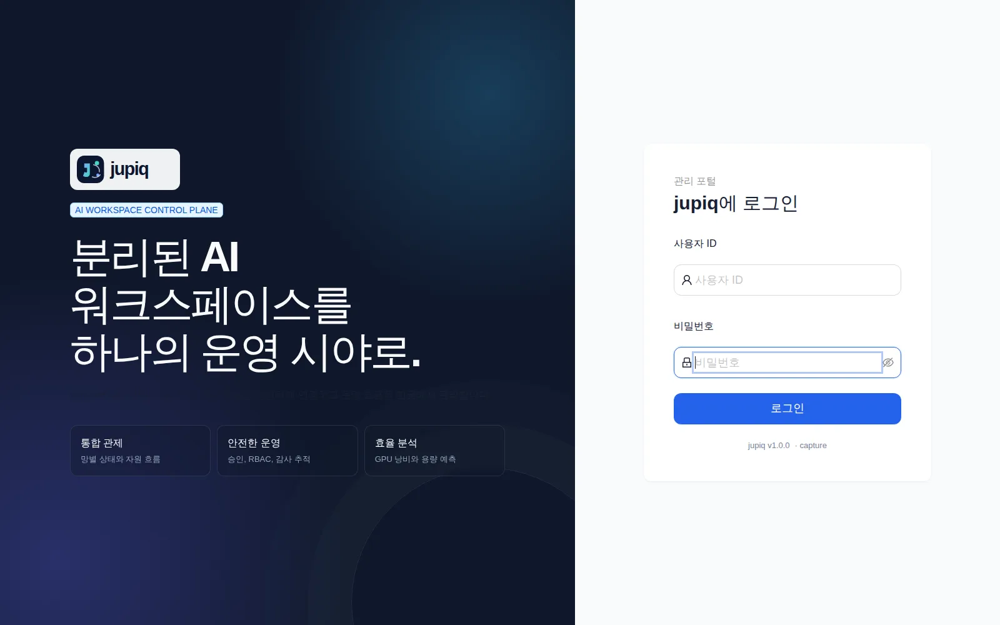

- 관리자가 Keycloak SSO를 켠 환경에서는 **`<제공자> SSO로 로그인`** 버튼이 먼저 나오고, 그 아래
  `또는 비상 관리자 계정` 구분선과 로컬 로그인 폼이 있습니다. SSO를 아직 켜지 않았으면 로컬 로그인만 보입니다.
- 카드 아래에 현재 **서비스 버전**이 표시됩니다. 문의할 때 이 값을 함께 알려 주면 확인이 빨라집니다.
- 로그인에 실패하면 카드 위에 `로그인 실패` 알림이 뜨고 원인이 함께 표시됩니다(→ [5. 막혔을 때](#5-막혔을-때)).

### 2.2 첫 화면을 확인한다

로그인하면 권한에 따라 접근 가능한 첫 화면으로 들어갑니다. `dashboard:read` 권한이 있으면 **통합 대시보드**입니다.

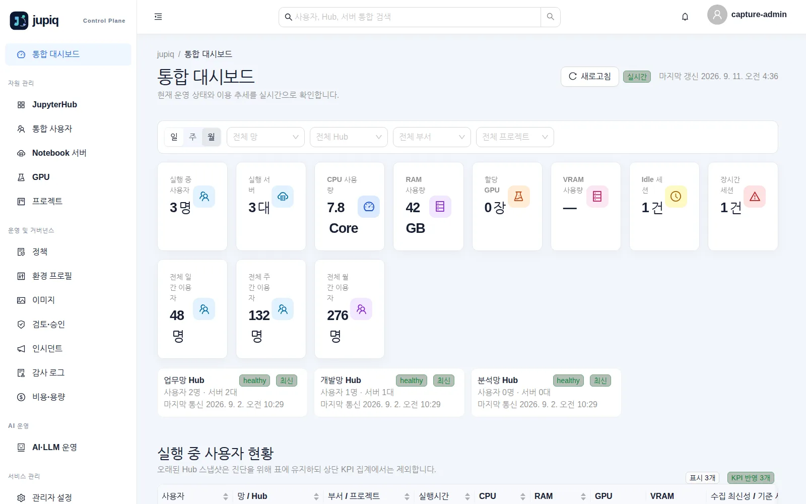

위에서부터 이렇게 읽습니다.

1. 제목 오른쪽의 `새로고침` 버튼과 **마지막 갱신** 시각 — 지금 보는 숫자가 언제 것인지.
2. `일 / 주 / 월` 기간 선택과 `전체 망`·`전체 Hub`·`전체 부서`·`전체 프로젝트` 필터.
3. KPI 카드 — 실행 중 사용자, 실행 서버, CPU 사용량, RAM 사용량, Idle 세션, 장시간 세션, 전체 일·주·월간 이용자.
   관리자가 GPU 모니터링을 켠 환경에서는 `할당 GPU`·`VRAM 사용량` 카드가 더 붙습니다.
4. 망별 Hub 카드 — Hub 이름, 상태(`healthy`·`degraded`), 신선도(`최신`·`오래됨`), 사용자·서버 수, 마지막 통신 시각.
5. **실행 중 사용자 현황** 표 — 사용자, 망/Hub, 부서/프로젝트, 실행시간, CPU, RAM, 수집 최신성.

> 오래된 Hub 스냅샷은 진단을 위해 표에는 남지만 상단 KPI 집계에서는 제외됩니다. 표 오른쪽 위의
> `표시 N개` / `KPI 반영 N개` 배지로 그 차이를 확인할 수 있습니다.

### 2.3 내 계정과 버전을 확인한다

오른쪽 위 사용자 이름을 누르면 프로필 메뉴가 열립니다.

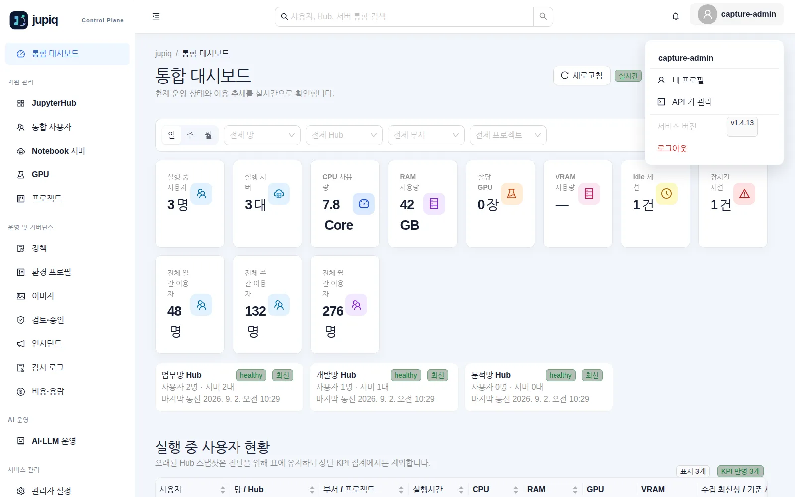

여기서 `내 프로필`, `API 키 관리`(권한이 있을 때), `서비스 버전`, `로그아웃`으로 갑니다.

### 2.4 찾는 대상으로 바로 간다

상단 가운데 검색창에 사용자 ID나 Hub, 서버 이름을 넣으면 권한 범위 안에서 한 번에 찾습니다.

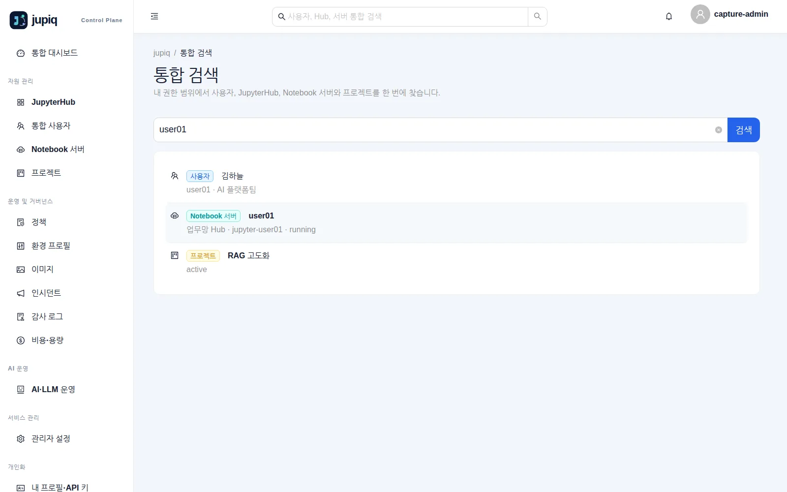

결과를 누르면 해당 상세 화면으로 이동합니다. 여기까지가 처음 5분입니다.

---

## 3. 화면별 사용법

메뉴는 `통합 대시보드` / `자원 관리` / `운영 및 거버넌스` / `AI 운영` / `서비스 관리` / `개인화` 묶음으로 나뉩니다.
권한이 없는 메뉴는 아예 표시되지 않습니다.

### 3.1 통합 대시보드

**현재 운영 상태와 이용 추세를 실시간으로 확인합니다.**

GPU 모니터링이 꺼진 기본 환경에서는 GPU 관련 카드와 메뉴가 나오지 않습니다.

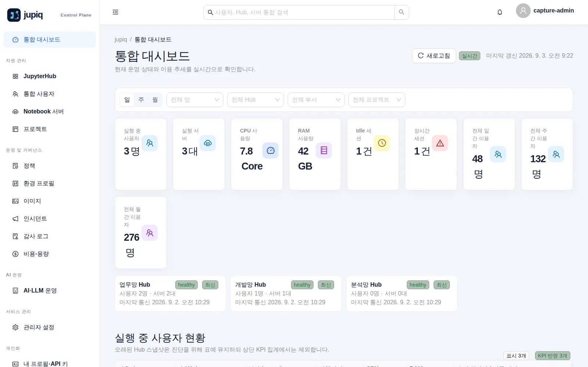

기간 버튼 `일 / 주 / 월`을 바꾸면 전체 이용자 집계와 추세가 그 기간 기준으로 다시 계산됩니다.

수집이 밀리면 화면 위에 경고가 붙습니다.

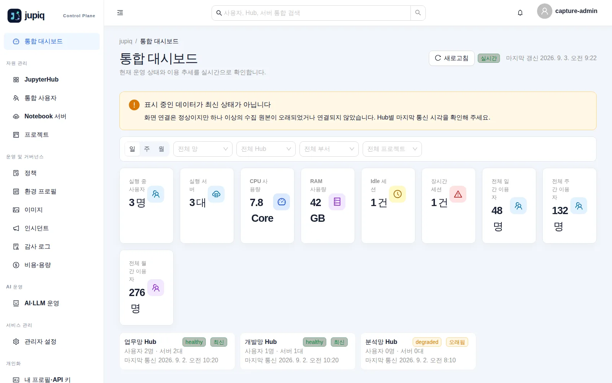

- 경고 문구: **표시 중인 데이터가 최신 상태가 아닙니다** / 화면 연결은 정상이지만 하나 이상의 수집 원본이
  오래되었거나 연결되지 않았습니다. Hub별 마지막 통신 시각을 확인해 주세요.
- 이때 보이는 숫자를 "현재 사용량"으로 단정하지 마세요. 해당 Hub 카드의 마지막 통신 시각을 확인하고,
  계속 `degraded`·`오래됨`이면 관리자에게 알려 주세요. 수집 원본을 고치는 일은 관리자 몫입니다.

### 3.2 JupyterHub

**망별 Hub 연결, 수집 상태와 버전을 중앙에서 관리합니다.**

- 표에서 Hub의 망, URL, 상태(`온라인`·`성능 저하`), 버전, 사용자 수, 실행 서버 수, 마지막 통신 시각을 봅니다.
- 오른쪽 `작업` 열에서 연결 테스트·동기화·수정·삭제를 합니다. 쓰기 권한(`hubs:write`)이 없으면 조회만 됩니다.
- Hub 등록·수정은 `+ Hub 등록` 버튼의 Drawer에서 하며, **저장 전에 현재 입력값으로 연결을 검증**할 수 있습니다.
  등록 항목과 검증 절차는 관리자 가이드의 [JupyterHub 등록](ADMIN_GUIDE.md#33-jupyterhub-등록)을 보세요.

### 3.3 통합 사용자

**모든 Hub의 사용자, 조직, 활동과 자원 현황을 조회합니다.**

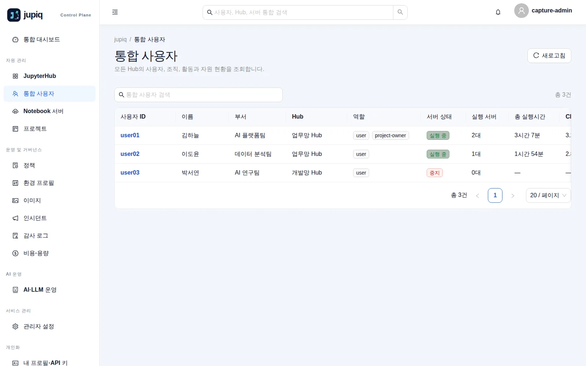

검색창으로 좁히고, 열 머리글로 정렬합니다. 사용자 ID를 누르면 상세로 들어갑니다.

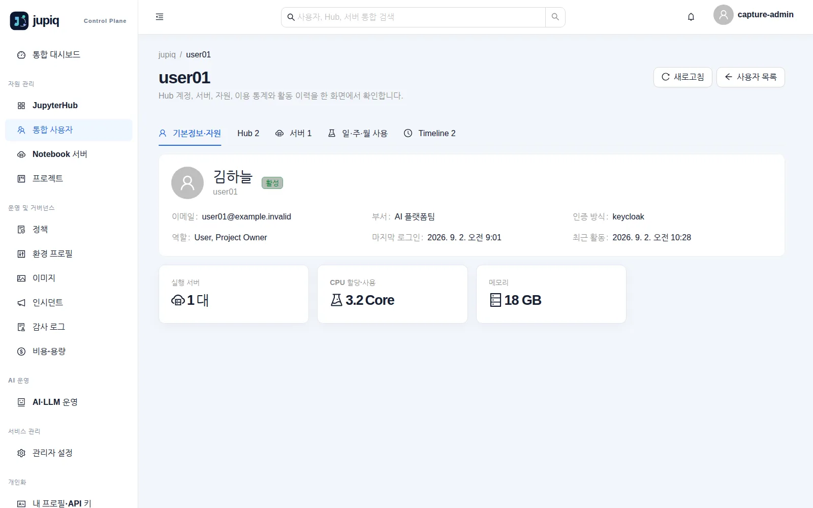

탭 구성은 이렇습니다.

| 탭 | 보이는 것 |
|---|---|
| 기본정보·자원 | 이름, 이메일, 부서, 인증 방식, 역할, 마지막 로그인·최근 활동과 실행 서버·CPU·메모리 요약 |
| Hub | 이 사용자가 계정을 가진 Hub 목록과 Hub별 마지막 활동·동기화 시각 |
| 서버 | 현재 서버와 과거 서버 이력(상태, 실행시간, 자원, Node/Pod, 이미지) |
| 일·주·월 사용 | 로그인 수, 서버 시작 수, 실행시간, CPU·메모리 평균/최대 |
| Timeline | 로그인·서버 시작 같은 활동 이력과 결과 |

관리자가 LLM 사용량 모니터링을 켠 환경에서는 LLM 사용량이 함께 표시됩니다.

### 3.4 Notebook 서버

**사용자 서버의 실행 상태와 자원을 확인하고 안전하게 제어합니다.**

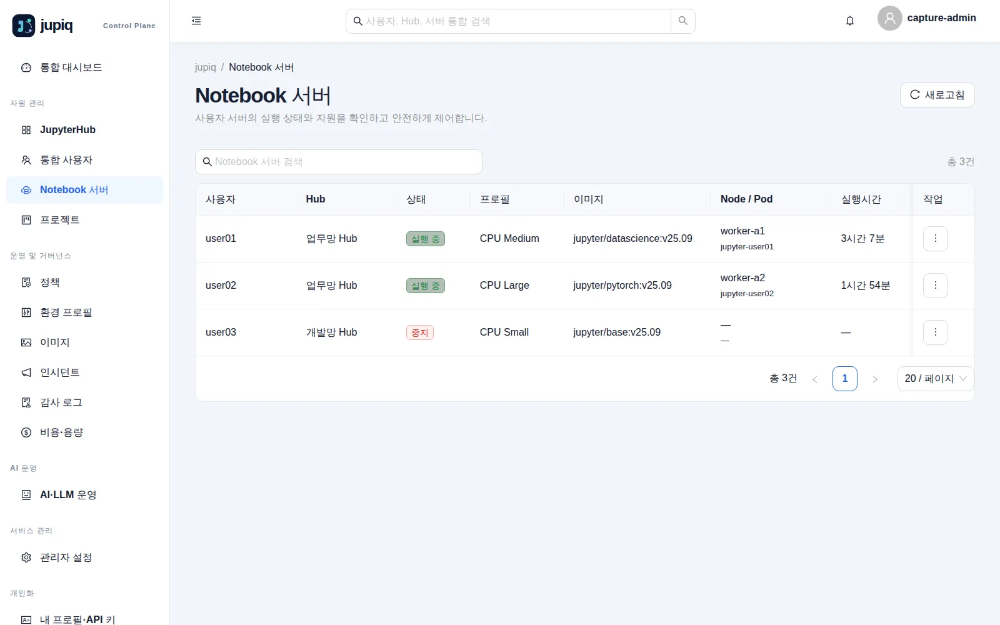

`servers:operate` 권한이 있으면 행 오른쪽에서 상태에 맞는 작업만 보입니다.

| 작업 | 보이는 조건 | 확인 문구 |
|---|---|---|
| 서버 시작 | 실행 중·시작 중이 아닐 때 | 없음(바로 실행) |
| 서버 종료 | 실행 중일 때 | 사용자 작업이 중단될 수 있습니다. 서버를 종료하시겠습니까? |
| 서버 재시작 | 실행 중일 때 | 현재 커널 연결이 끊어집니다. 서버를 재시작하시겠습니까? |

관리자가 승인 프로세스를 켠 환경에서는 실행 대신 **승인 요청이 등록되었습니다. 검토·승인 완료 후 작업이
실행됩니다.** 라는 안내가 뜨고, 요청은 `검토·승인` 화면으로 넘어갑니다.

### 3.5 GPU

**실행 서버·Pod·사용자별 GPU 할당과 수집 지표를 확인합니다.** 관리자가 GPU 모니터링을 켠 경우에만 메뉴가 나옵니다.

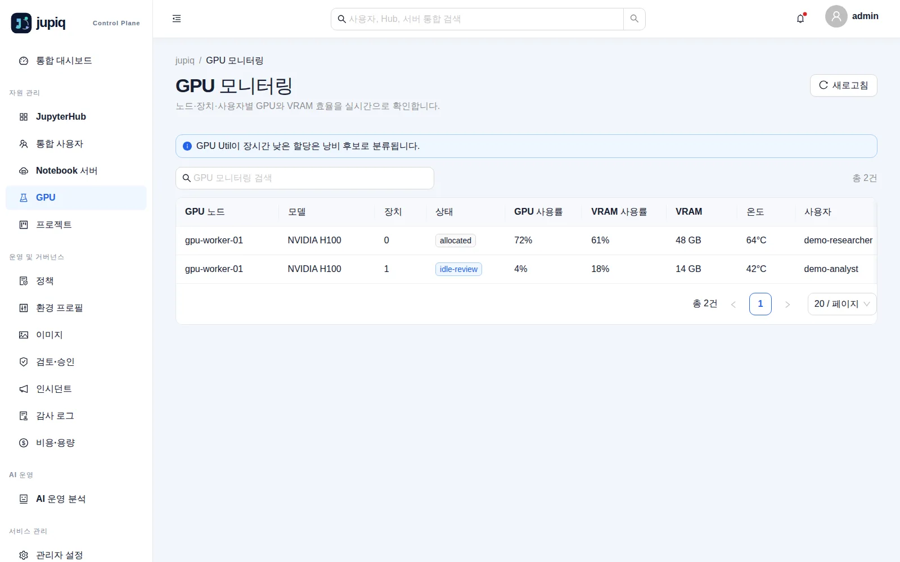

화면 위 안내대로 **GPU Util이 장시간 낮은 할당은 낭비 후보로 분류**됩니다. 지표는 DCGM Exporter 값을 Pod
단위로 집계한 것이며, GPU 모니터링을 끄면 수집·API·화면 노출이 모두 중단됩니다.

### 3.6 프로젝트

**구성원, 기간과 계획 자원 한도를 프로젝트 단위 카탈로그로 관리합니다.**

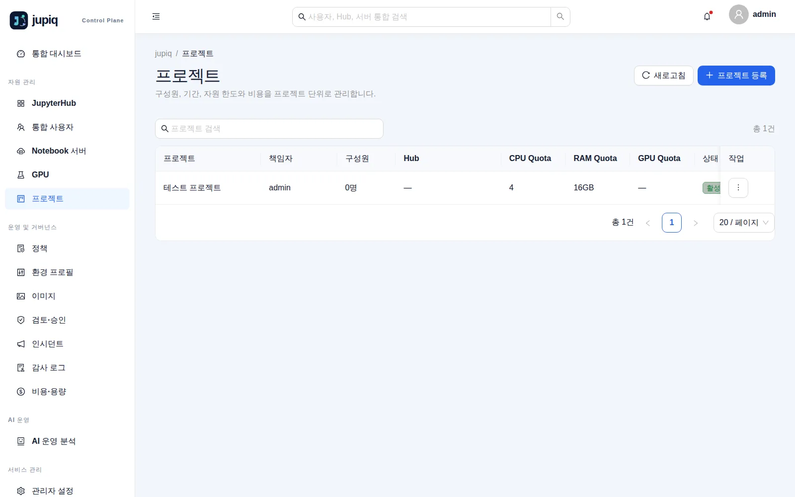

화면 위 안내대로 이 버전은 **프로젝트·Quota 등록과 조회**를 제공하며, JupyterHub나 Kubernetes에 Quota를
자동으로 집행하지는 않습니다. 여기 적은 한도는 합의된 계획값입니다.

### 3.7 정책 · 환경 프로필 · 이미지

세 화면 모두 "등록해 두고 비교하는 카탈로그"입니다. 자동 배포·자동 집행은 이 버전의 범위가 아닙니다.

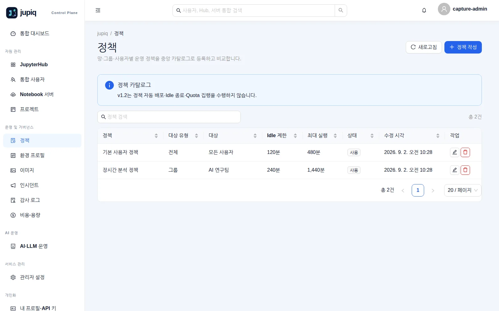

**정책**은 망·그룹·사용자별 운영 정책(Idle 제한, 최대 실행시간)을 등록해 비교합니다. 정책 자동 배포·Idle
종료·Quota 집행은 수행하지 않습니다.

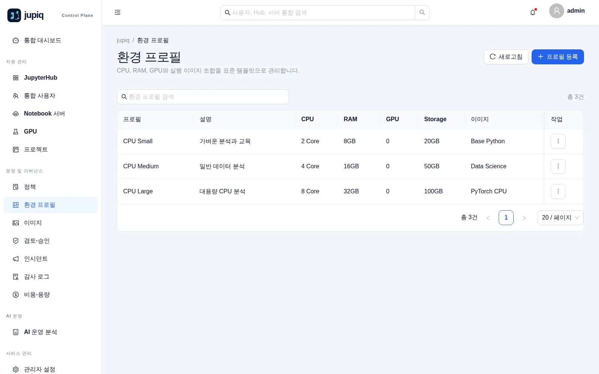

**환경 프로필**은 CPU·RAM·GPU와 실행 이미지 조합을 표준 템플릿으로 관리합니다. Hub Spawner 자동 배포와
rollback은 후속 범위입니다.

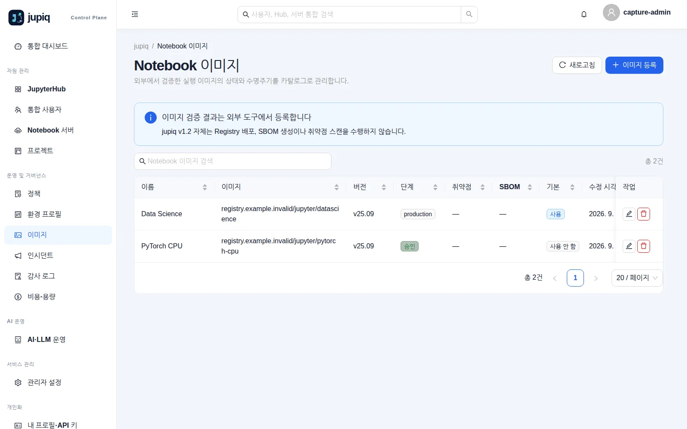

**이미지**는 외부에서 검증한 실행 이미지의 상태와 수명주기를 기록합니다. jupiq 자체가 Registry 배포, SBOM
생성이나 취약점 스캔을 수행하지는 않으며, 검증 결과는 외부 도구에서 등록합니다.

### 3.8 검토·승인

**팀장 검토와 최종 승인 권한을 분리해 운영 요청을 안전하게 처리합니다.** 관리자가 승인 프로세스를 켠
경우에만 메뉴가 나옵니다.

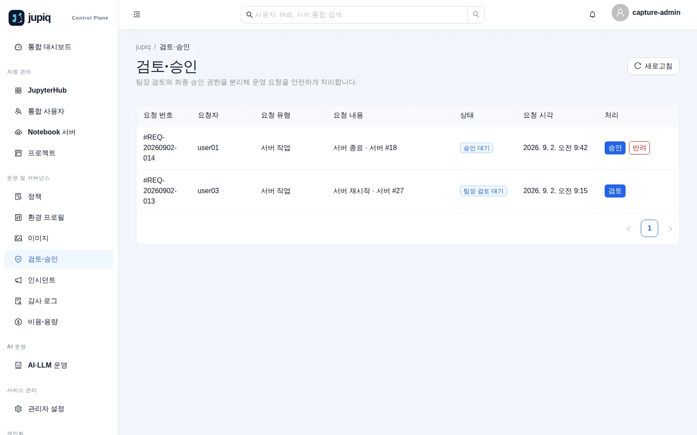

- 상태는 `팀장 검토 대기` → `승인 대기` → 처리 완료 순으로 흐릅니다. 팀장 선검토를 끄면 `승인 대기`부터 시작합니다.
- 행 오른쪽에 자기 권한으로 할 수 있는 버튼만 보입니다(`검토` / `승인` / `반려`).
- 규칙은 화면 밖에서도 지켜집니다. **요청자는 자기 요청을 검토·승인·반려할 수 없고**, 팀장 선검토를 쓰면
  **검토자와 최종 승인자도 서로 달라야** 합니다. 관리자가 사유 필수를 켜 두면 사유 없이 처리할 수 없습니다.
- 승인 대상은 Notebook 서버 제어(시작·종료·재시작)입니다.

### 3.9 인시던트

**Hub, Pod, GPU와 인증 장애를 수동 등록해 영향과 복구 상태를 추적합니다.**

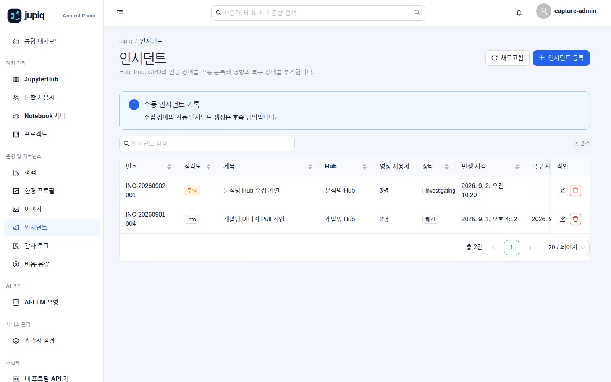

수집 장애를 자동으로 인시던트로 만들지는 않습니다. 사람이 등록하고 상태를 갱신하는 기록장입니다.

### 3.10 감사 로그

**사용자·관리자·API 작업의 대상, 변경 전후와 결과를 추적합니다.**

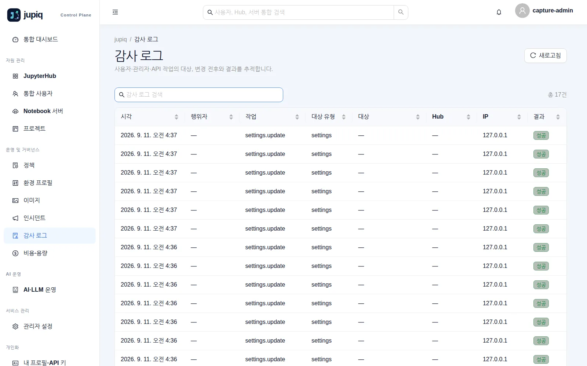

작업 이름(`settings.update`, `hub.connection.test` 등)과 결과(`성공`/`실패`)로 무엇이 언제 바뀌었는지 확인합니다.
감사 추적을 위해 감사 기록과 승인 요청은 화면에서 삭제할 수 없습니다.

### 3.11 비용·용량

**관리자가 등록한 부서·프로젝트·망별 비용 산정 결과를 조회합니다.**

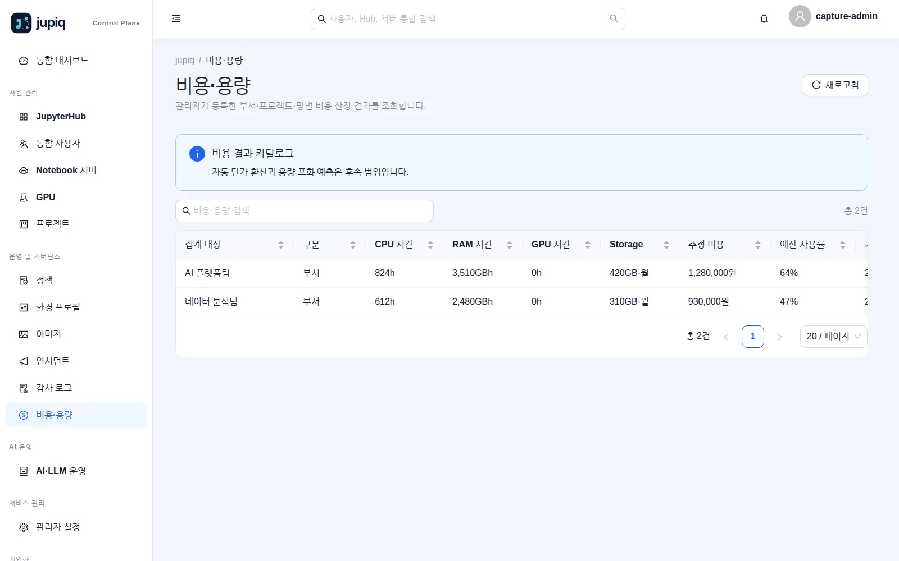

등록된 산정 결과를 보여 주는 카탈로그이며, 자동 단가 환산과 용량 포화 예측은 후속 범위입니다.
GPU 모니터링이 꺼져 있으면 GPU 관련 열은 표시되지 않습니다.

### 3.12 AI·LLM 운영

**입력한 메시지에 대한 Provider 응답을 기본 스트리밍으로 받습니다.** `AI 운영 분석`과 `LLM API 사용량` 두 탭이 있습니다.

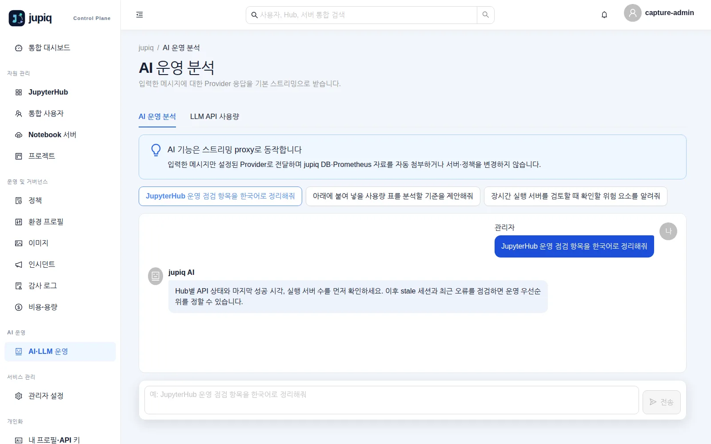

- 화면 위 안내대로 **AI 기능은 스트리밍 proxy로 동작**합니다. 입력한 메시지만 관리자가 설정한 Provider로
  전달하며, jupiq DB·Prometheus 자료를 자동으로 붙이거나 서버·정책을 변경하지 않습니다.
- 표나 수치를 분석하고 싶으면 입력창에 직접 붙여 넣으세요.
- `LLM API 사용량` 탭은 관리자가 LLM 사용량 모니터링을 켠 환경에서 호출 수·성공률·지연·토큰·추정 비용을 보여 줍니다.

### 3.13 알림 센터

**운영 알림 규칙과 수동 기록을 카탈로그로 관리합니다.** 상단 종 모양 버튼으로도 들어옵니다.

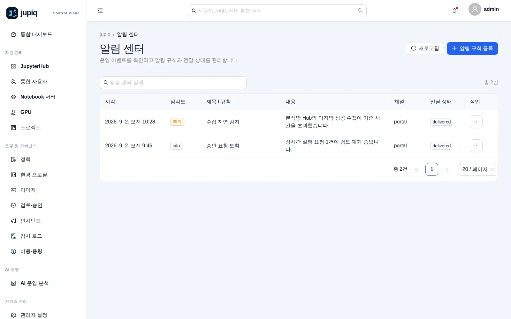

Webhook은 관리자 연결 테스트만 제공하며, 운영 이벤트 자동 발송은 후속 범위입니다.

### 3.14 내 프로필 · API 키

`개인화 → 내 프로필·API 키`입니다. 두 탭으로 나뉩니다.

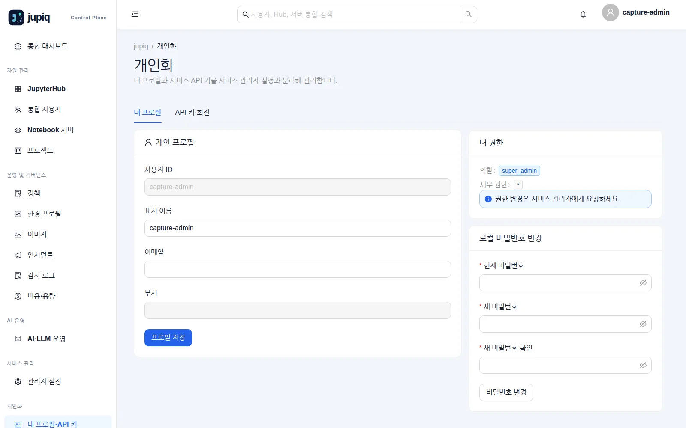

- 왼쪽에서 표시 이름·이메일·부서를 고치고 `프로필 저장`을 누릅니다(사용자 ID는 바꿀 수 없습니다).
- 오른쪽 `내 권한`에서 내 역할과 세부 권한을 확인합니다. **권한 변경은 서비스 관리자에게 요청**하세요.
- 로컬 계정은 `로컬 비밀번호 변경`에서 현재 비밀번호와 새 비밀번호를 넣어 바꿉니다. 성공하면
  **비밀번호를 변경하고 다른 로그인 세션을 종료했습니다.** 안내가 뜹니다.

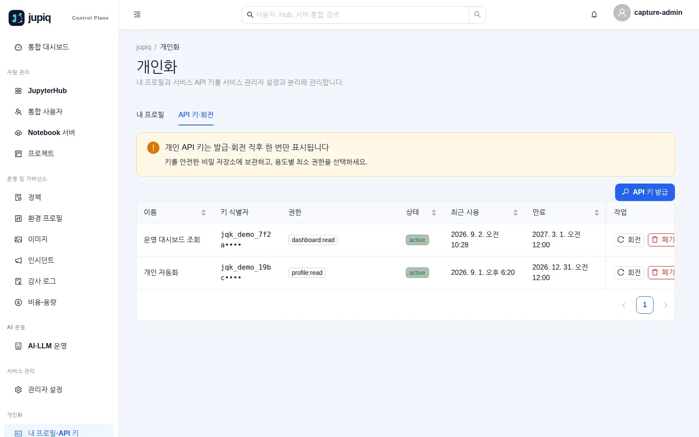

- 화면 위 경고대로 **개인 API 키는 발급·회전 직후 한 번만 표시됩니다.** 그 자리에서 안전한 비밀 저장소로 옮기세요.
- `API 키 발급`에서 이름, 권한(내 권한 안에서만 선택), 유효기간(일)을 지정합니다.
- `회전`은 새 키를 발급하고 이전 키를 즉시 못 쓰게 만듭니다. `폐기`한 키는 복구할 수 없습니다.
- 목록에는 키 식별자(prefix)와 마스킹된 값만 남습니다. 평문은 화면에서도 API에서도 다시 볼 수 없습니다.

### 3.15 모바일에서 보기

좁은 화면에서는 왼쪽 메뉴가 접히고 상단 메뉴 버튼으로 열립니다. 기능은 같습니다.

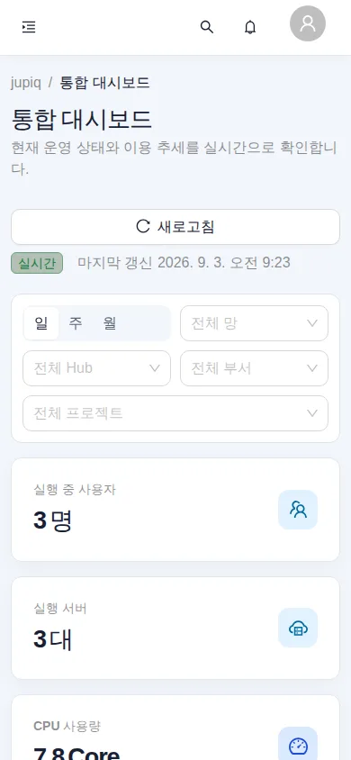

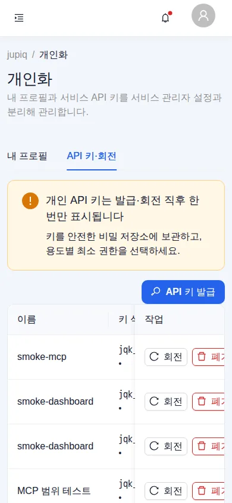

---

## 4. 자주 하는 작업

### 4.1 "지금 누가 서버를 켜 두고 있나" 확인하기

1. `통합 대시보드`를 엽니다.
2. **마지막 갱신** 시각과 Hub 카드의 신선도 배지를 먼저 확인합니다.
3. 필요하면 `전체 망`·`전체 Hub`·`전체 부서`·`전체 프로젝트` 필터로 좁힙니다.
4. `실행 중 사용자 현황` 표에서 실행시간·CPU·RAM 순으로 정렬합니다.
5. 표의 `수집 최신성`이 `오래됨`인 행은 KPI에 반영되지 않은 값이므로 따로 취급합니다.

### 4.2 놀고 있는 서버 정리하기

1. 대시보드 KPI에서 `Idle 세션`·`장시간 세션` 건수를 확인합니다.
2. `Notebook 서버` 화면에서 실행시간과 CPU·RAM으로 정렬해 대상을 고릅니다.
3. 사용자에게 먼저 알리고, 행 오른쪽 `서버 종료`를 누른 뒤 확인 문구에 동의합니다.
4. 승인 프로세스가 켜진 환경이면 요청만 등록되므로, `검토·승인` 화면에서 처리될 때까지 기다립니다.
5. 결과는 `감사 로그`에 남습니다. 작업·대상·결과로 확인합니다.

### 4.3 특정 사용자의 한 달치 사용량 정리하기

1. 상단 검색창에 사용자 ID를 넣거나 `통합 사용자`에서 찾습니다.
2. 사용자 상세의 `일·주·월 사용` 탭에서 월 기준 로그인 수, 서버 시작 수, 실행시간, CPU·메모리 평균/최대를 봅니다.
3. `서버` 탭에서 그 기간의 서버 이력을, `Timeline` 탭에서 활동 이력을 확인합니다.
4. 숫자를 옮겨 적을 때는 화면의 기준 시각을 함께 적어 두세요.

### 4.4 자동화용 개인 API 키 만들기

1. `개인화 → 내 프로필·API 키 → API 키·회전`으로 갑니다.
2. `API 키 발급`을 누르고 이름, 필요한 권한만, 유효기간을 지정합니다.
3. 한 번만 표시되는 키를 비밀 저장소에 저장합니다.
4. 자동화에서는 `Authorization: Bearer jqk_...` 헤더로 씁니다.
5. 회전 주기가 되면 `회전`을 눌러 새 키로 바꾸고, 쓰지 않는 키는 `폐기`합니다.

### 4.5 GPU를 놀리고 있는 할당 찾기

1. `GPU` 화면을 엽니다(메뉴가 없으면 관리자가 GPU 모니터링을 켜지 않은 것입니다).
2. `GPU 사용률` 열로 오름차순 정렬합니다.
3. 사용률이 낮은데 `할당 GPU`와 `VRAM 사용량`이 큰 행을 봅니다.
4. `사용자`·`Pod` 열로 담당자를 찾고, `수집 시각`과 `최신성`으로 값이 최근 것인지 확인합니다.

---

## 5. 막혔을 때

### 화면에 나오는 메시지

| 보이는 문구 | 뜻과 할 일 |
|---|---|
| 로그인 실패 / **아이디와 비밀번호를 입력하세요** | 둘 중 하나가 비어 있습니다. 다시 입력하세요. |
| 로그인 실패 / **로그인 시도가 너무 많습니다. 잠시 후 다시 시도하세요** | 실패가 반복돼 일시적으로 막혔습니다. 10분 정도 기다린 뒤 다시 시도하고, 비밀번호를 모르면 관리자에게 재설정을 요청하세요. |
| 로그인 실패 / **아이디 또는 비밀번호 길이가 허용 범위를 초과했습니다** | 입력값이 너무 깁니다. 붙여넣기에 공백·줄바꿈이 섞이지 않았는지 확인하세요. |
| **현재 비밀번호가 올바르지 않습니다** | 비밀번호 변경 화면에서 현재 비밀번호가 틀렸습니다. |
| **인증 서비스를 확인할 수 없습니다** | jupiq가 인증 정보를 확인하지 못했습니다. `다시 시도`를 누르고, 반복되면 관리자에게 알리세요. |
| **서버에 연결할 수 없습니다.** | 브라우저가 jupiq에 닿지 못했습니다. 망 연결과 주소를 확인하고, 관리자에게 서비스 상태를 물어보세요. |
| **데이터베이스 연결을 확인할 수 없습니다** | 서비스는 떴지만 DB에 닿지 못하는 상태입니다. 관리자 몫입니다. |
| **표시 중인 데이터가 최신 상태가 아닙니다** | 수집 원본이 오래됐거나 끊겼습니다. Hub 카드의 마지막 통신 시각을 확인하고, 계속되면 관리자에게 알리세요. |
| **접근 권한이 없습니다** (관리자 설정 권한(settings:write)이 필요합니다.) | 그 화면에 필요한 권한이 없습니다. 필요하면 관리자에게 요청하세요. |
| **페이지를 찾을 수 없습니다** / 주소가 변경되었거나 접근할 수 없는 메뉴입니다. | 주소가 잘못됐거나 권한이 사라진 경로입니다. `대시보드로 이동`으로 돌아가세요. |
| **요청한 대상을 찾을 수 없습니다** | 대상이 이미 지워졌거나 이름이 바뀌었습니다. 목록에서 다시 찾으세요. |
| **요청을 처리하지 못했습니다** | 서버에서 처리에 실패했습니다. 잠시 뒤 다시 시도하고, 반복되면 시각과 하던 작업을 적어 관리자에게 알리세요. |
| **승인 요청이 등록되었습니다. 검토·승인 완료 후 작업이 실행됩니다.** | 오류가 아닙니다. 승인 프로세스가 켜져 있어 요청만 등록됐습니다. |
| **요청자는 자신의 요청을 승인할 수 없습니다** (검토·반려도 같음) | 규칙대로 막힌 것입니다. 다른 권한자에게 처리를 요청하세요. |
| **검토자와 승인자는 서로 달라야 합니다** | 팀장 선검토를 한 사람이 최종 승인까지 할 수 없습니다. |
| **사유를 입력해야 합니다** | 관리자가 사유 필수를 켰습니다. 사유를 적고 다시 처리하세요. |
| **이미 처리 중이거나 완료된 승인 요청입니다** / **다른 사용자가 이미 검토했습니다** | 그사이 다른 사람이 처리했습니다. 새로고침해서 최신 상태를 보세요. |
| **연결 테스트에 실패했습니다** / 망 연결, 주소, TLS 인증서, 인증 정보와 조회 권한을 차례대로 확인해 주세요. | 관리자 설정에서 외부 연동 검증에 실패했습니다. 관리자 가이드의 연동 절차를 보세요. |
| **관리자가 허용한 API 키 권한 범위를 초과했습니다** | 관리자가 정한 키 허용 권한 밖의 권한을 고른 것입니다. 범위 안에서 다시 고르세요. |
| **브라우저 로그인 세션에서만 계정 정보를 변경할 수 있습니다** | 프로필·비밀번호·역할 변경 같은 작업은 API 키로 할 수 없습니다. 브라우저에서 로그인해 진행하세요. |

### 그 밖의 증상

- **메뉴가 안내서보다 적게 보입니다.** 정상입니다. 권한이 없는 메뉴는 표시되지 않습니다. 필요한 화면이 있으면
  `개인화 → 내 프로필`에서 내 역할·세부 권한을 확인해 관리자에게 요청하세요.
- **GPU·AI·승인 메뉴가 없습니다.** 이 세 기능은 기본이 OFF이고, 관리자가 켠 환경에서만 나타납니다.
- **로그인 화면으로 돌아갔습니다.** 세션이 만료된 것입니다. 다시 로그인하면 보던 화면으로 돌아갑니다.
- **목록이 비어 있습니다.** 검색어·필터를 지워 보세요. 그래도 비어 있으면 아직 수집·등록된 자료가 없는 것입니다.

---

## 6. 용어

| 화면에 나오는 말 | 뜻 |
|---|---|
| 망 | 서로 분리된 네트워크 구획. Hub는 망 하나에 속합니다. |
| Hub | jupiq에 등록된 JupyterHub 하나. |
| 실행 중 사용자 | 실행 중인 Notebook 서버가 있는 사용자. 브라우저 접속자 수가 아닙니다. |
| 최신 / 오래됨 | 그 값이 최근 수집분인지, 기준 시각이 지난 값인지. `오래됨`은 KPI 집계에서 빠집니다. |
| healthy / degraded | Hub 수집 상태. `degraded`는 최근 수집에 실패했다는 뜻입니다. |
| Idle 세션 | 실행 중이지만 활동이 없는 세션. |
| 장시간 세션 | 기준보다 오래 실행 중인 세션. |
| 프로필(환경 프로필) | CPU·RAM·GPU·이미지 조합 템플릿. 내 프로필(계정)과 다릅니다. |
| Node / Pod | 서버가 실제로 뜬 Kubernetes 노드와 Pod 이름. |
| 세부 권한 | `hubs:read`처럼 `대상:동작` 형식의 권한 단위. |
| 적용 범위(전역 / 제한) | 역할이 모든 대상에 적용되는지, 특정 Hub·부서에만 적용되는지. |
| 키 식별자(prefix) | API 키 앞부분. 평문 키 대신 목록에서 키를 구분하는 데 씁니다. |
| Fresh / Stale | 수집 자료의 신선도. 화면에서는 `최신`·`오래됨`으로 표시됩니다. |

---

## 더 볼 곳

- 설치·연동·권한·장애 대응: [관리자 가이드](ADMIN_GUIDE.md) (PDF: [ADMIN_GUIDE.pdf](ADMIN_GUIDE.pdf))
- 이 문서의 PDF: [USER_GUIDE.pdf](USER_GUIDE.pdf)
- 전체 화면 갤러리: [docs/screenshots](screenshots/index.html)
- API·MCP: 저장소의 [`openapi/`](../openapi/)
